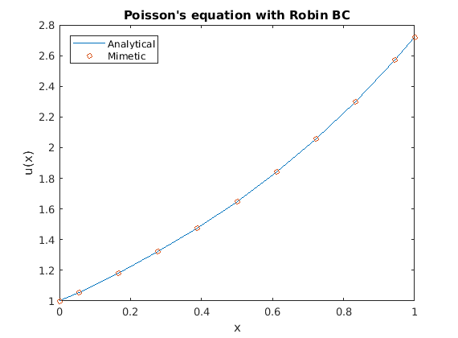

# Summary

MOLE is a high quality (C++ & MATLAB) library that implements high-order mimetic operators to solve partial differential equations. It provides discrete analogs of the most common vector calculus operators: Gradient, Divergence, Laplacian and Curl. These operators (matrices) act on staggered grids (uniform and nonuniform) and they satisfy local and global conservation laws.

The mathematics is based on the work of [@Corbino]. However the user may find useful previous publications such as [@Castillo], in which similar operators are derived using a matrix analysis approach.

# Mimetic operators

All linear transformations can be represented by a matrix multiplication, integration and differentiation are linear transformations. Mimetic operators are essentially matrices that when applied to discrete scalar or vector fields produce high-order approximations that are faithful to the physics.

The basis of higher-dimensional operators, as well of more sophisticated operators such as the Laplacian or the Biharmonic operator are the one-dimensional mimetic Gradient (**G**) and Divergence (**D**) operators. These operators can be reused throughout the model and they provide a higher level of abstraction at the time of solving differential equations.

# The library

MOLE was designed to be an intuitive software package to numerically solve partial differential equations using mimetic methods. MOLE is implemented in C++ and in MATLAB scripting language (these are two independent flavors) and every single function in MOLE returns a sparse matrix of the requested mimetic operator. For information on the installation or usage of the library, please read the [User's Manual](https://github.com/jcorbino/mole/blob/master/MOLE%20User's%20Manual%20(MATLAB%20version).pdf) which is included in the repository.

For example, if the user wants to get a 1D *k*-order mimetic Laplacian, just need to invoke:
```matlab
lap(k, m, dx);
```
where **k** is the desired order of accuracy, **m** is the number of cell centers (spatial resolution), and **dx** is the step length. All functions in MOLE are quite consistent with this syntax.

\pagebreak

The following code snippet shows how easy is to solve a boundary value problem (with Robin's boundary conditions) through MOLE:
```matlab
addpath('../mole_MATLAB')

west = 0;  % Domain's limits
east = 1;

k = 4;  % Operator's order of accuracy
m = 2*k+1;  % Minimum number of cells to attain the desired accuracy
dx = (east-west)/m;  % Step length

L = lap(k, m, dx);  % 1D Mimetic laplacian operator

% Impose Robin BC on laplacian operator
a = 1;
b = 1;
L = L + robinBC(k, m, dx, a, b);

% 1D Staggered grid
grid = [west west+dx/2 : dx : east-dx/2 east];

% RHS
U = exp(grid)';
U(1) = 0;  % West BC
U(end) = 2*exp(1);  % East BC

U = L\U;  % Solve a system of linear equations

% Plot result
plot(grid, U, 'o-')
title('Poisson''s equation with Robin BC')
xlabel('x')
ylabel('u(x)')
```



# References
