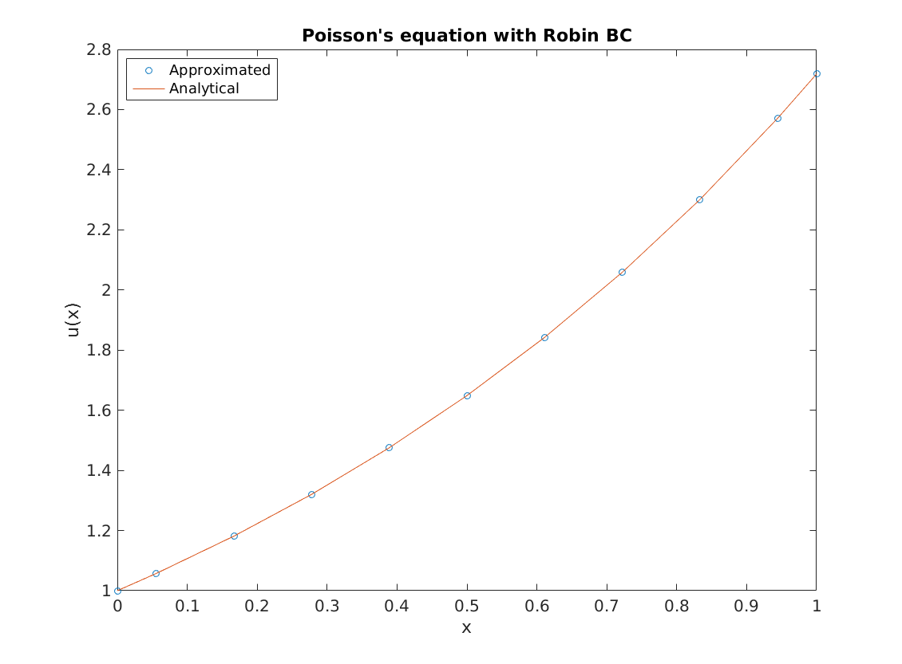

# Summary

MOLE is an open-source library that implements high-order mimetic operators. It provides discrete analogs of the most common vector calculus operators: divergence, gradient, curl, and Laplacian. These operators act on functions discretized over staggered grids (uniform, nonuniform, and curvilinear), and they satisfy local and global conservation laws [@R202203; @R202305]. MOLE's operators can be utilized to develop code for solving partial differential equations (PDEs).

The mathematics are based on the work of @Corbino. In addition, the user may find useful previous publications such as @Castillo, in which similar operators are derived using a matrix analysis approach.

# Mimetic operators

Mimetic operators, divergence (**D**), gradient (**G**), curl (**C**), and Laplacian (**L**), are discrete analogs of their corresponding continuum operators. These operators satisfy in the discrete sense the vector identities that the continuum ones do [@R202301], making them more faithful to the physics in specific contexts.

The basis of higher-dimensional operators, as well as more sophisticated operators such as the Laplacian or the biharmonic operator, are the one-dimensional mimetic **G** and **D** operators, together with high-order mimetic interpolation operators [@R202202], which are also contained in the library. These finite-dimensional operators can be reused throughout the mathematical model and they provide a higher level of abstraction at the time of solving PDEs.

These operators have been used to write codes to solve PDEs of different types [@Jared; @Bazan; @Boada; @Boada2; @Rojas; @Jorge; @Josep; @Abouali]. For an overview of mimetic methods of different types see the book by Castillo and Miranda and the references therein [@Miranda].

# Statement of need

Implementing mimetic operators, particularly in three dimensions, presents significant challenges, yet MOLE streamlines this process, allowing users to focus their efforts on their specific problems. For instance, solving equations like the Poisson equation $-\nabla^2 u = f$ becomes straightforward with MOLE, as users can employ its well-tested mimetic operators with just a few lines of code. This versatility extends to a diverse user base, including physicists, engineers, and numerical analysts, who benefit from MOLE's comprehensive library. Moreover, the library's flexibility enables users to seamlessly transition between grids, resolutions, and discretization orders, enhancing their ability to tailor solutions to their unique needs.

# State of the field

A previous library [@MTK] was developed to implement the mimetic operators presented in @Castillo. This library was only capable of handling dense matrices so it was limited to solve small problems hence its development was stopped. MOLE implements the operators presented in @Corbino. These operators are optimal from the number of points in each stencil and produce more accurate results. MOLE deals with sparse matrices efficiently and is capable of solving problems with millions of cells. To the best of the authors' knowledge, there are no other libraries that implement mimetic methods as the ones presented in this paper.

# The library

MOLE was designed to be an intuitive software package to construct mimetic operators based on the method of @Corbino. MOLE is implemented in C++ and in MATLAB (these are two independent flavors) and every function in MOLE returns a sparse matrix of the requested mimetic operator. For information on the installation or usage of the library, please read the [documentation](https://github.com/jcorbino/mole/blob/master/README.md) included in the repository.

Mimetic operators can be easily used to build codes to solve PDEs with a few lines of code. For example, if the user wants to get a one-dimensional *k*-order mimetic Laplacian, they just need to invoke:
```matlab
lap(k, m, dx);
```
where **k** is the desired order of accuracy, **m** is the number of cell centers (of the spatial grid), and **dx** is the distance between consecutive cell centers. All functions in MOLE are quite consistent with this syntax, and more information regarding the signature of the function can be accessed via the ```help``` command. The C++ version of the library depends on [*Armadillo*](http://arma.sourceforge.net/), which is an open-source package for dense and sparse linear algebra [@Arma], [*SuperLU*](https://portal.nersc.gov/project/sparse/superlu) for LU factorization [@SLU], and [*OpenBLAS*](https://www.openblas.net/) for parallel matrix-vector and matrix-matrix operations [@OBLAS].

It is important to mention that MOLE's main role is the construction of matrices that represent spatial derivative operators and boundary conditions; other components such as solvers and time steppers are only provided via self-contained examples.

The following code snippet shows how easy is to solve a 1D Poisson problem (with Robin's boundary conditions) through MOLE:
```matlab
% File: elliptic1D.m
addpath('../mole_MATLAB')  % Add path to library

west = 0;  % Domain's limits
east = 1;

k = 4;  % Operator's order of accuracy
m = 2*k+1;  % Minimum number of cells to attain the desired accuracy
dx = (east-west)/m;  % Step length

L = lap(k, m, dx);  % 1D Mimetic Laplacian operator

% Impose Robin BC on Laplacian operator
a = 1;  % Dirichlet coefficient
b = 1;  % Neumann coefficient
L = L + robinBC(k, m, dx, a, b);  % Add BCs to Laplacian operator

% 1D Staggered grid
grid = [west west+dx/2 : dx : east-dx/2 east];

% RHS
U = exp(grid)';
U(1) = 0;  % West BC
U(end) = 2*exp(1);  % East BC

U = L\U;  % Solve a system of linear equations

% Plot result
plot(grid, U, 'o-')
title('Poisson''s equation with Robin BC')
xlabel('x')
ylabel('u(x)')
```

{width=80%}

# Concluding remarks

In this short article we introduced MOLE, an open-source library that implements the mimetic operators from @Corbino. For conciseness purposes, we showed a one-dimensional Poisson problem as an example. However, MOLE includes over 30 examples that span a wide range of applications, from the one-way wave equation to highly nonlinear and computationally demanding problems, including the Navier-Stokes equation for fluid dynamics and Richard's equation for unsaturated flow in porous media. The user can find such examples in the [Examples](https://github.com/jcorbino/mole/blob/master/examples_MATLAB) folder.

# Acknowledgements

We acknowledge contributions from Dr. Angel Boada, and Jared Brzenski, whose dedicated efforts and insightful discussions significantly enhanced the development of the software tool.

# References
