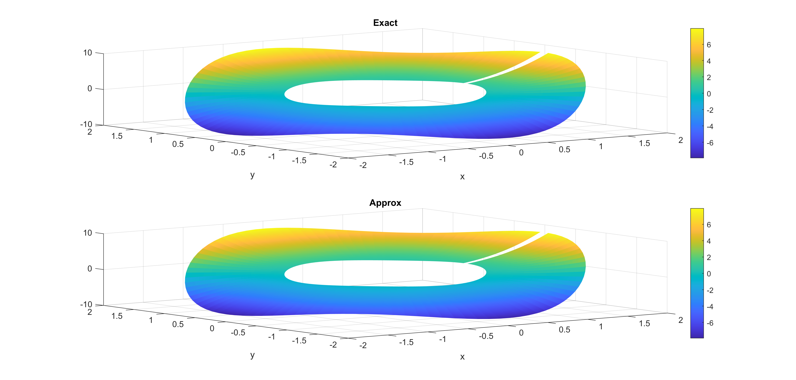
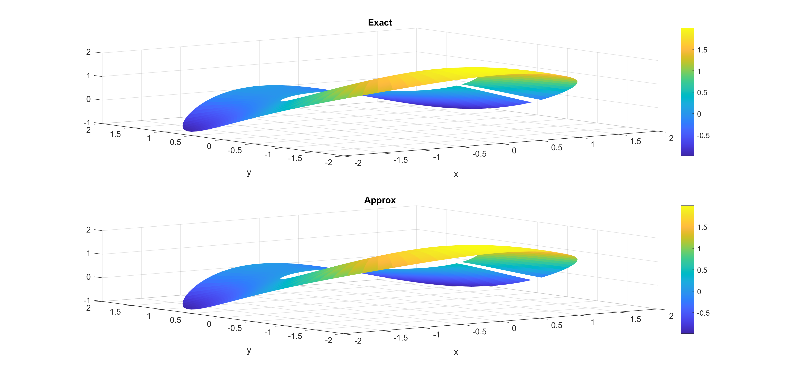
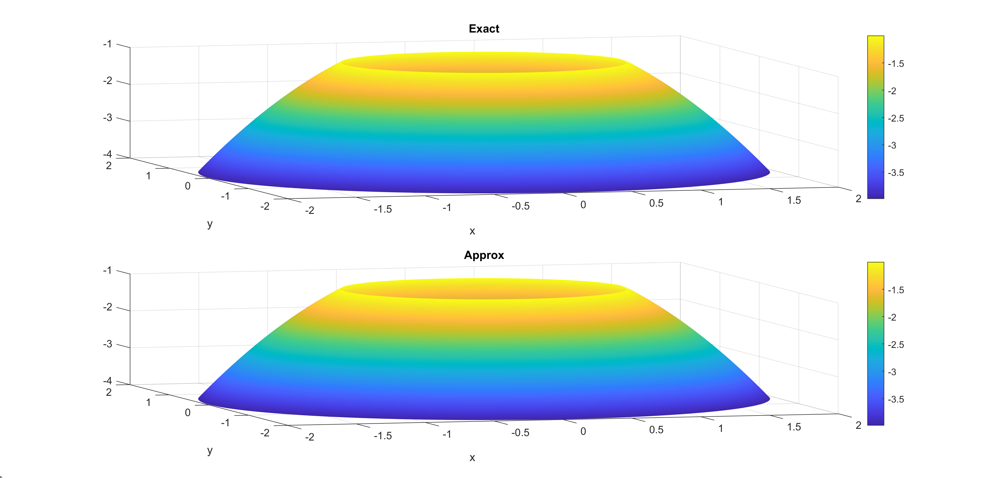
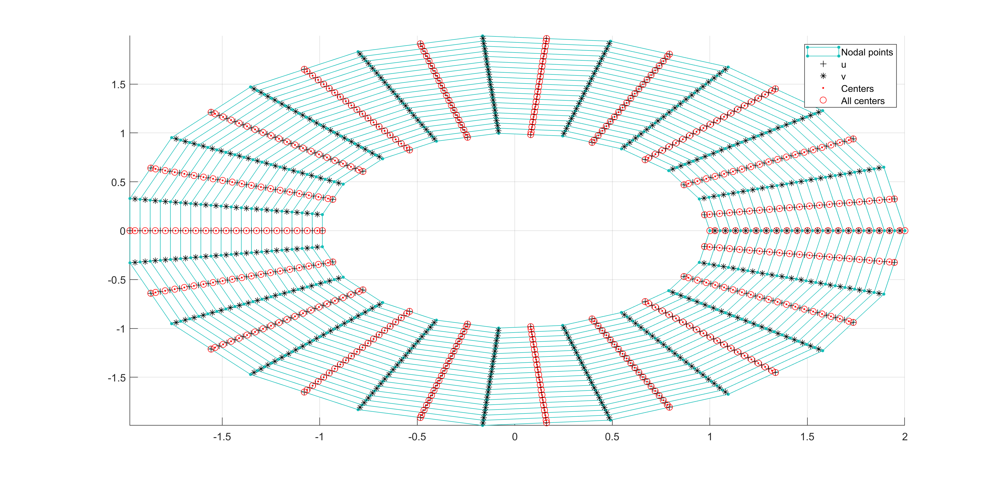
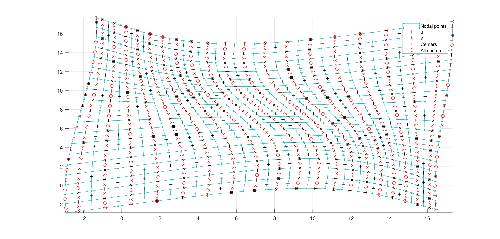
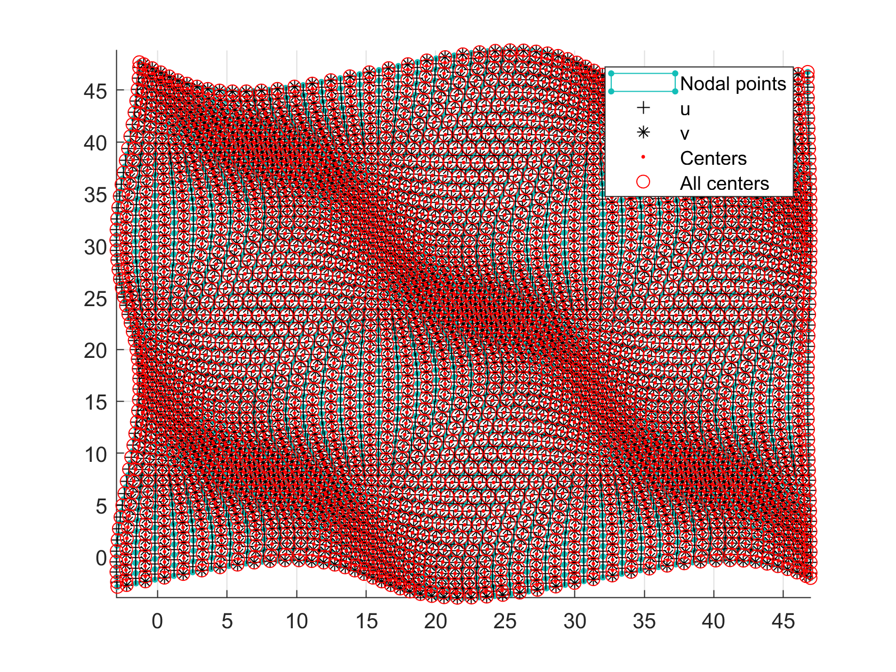

MOLE: Mimetic Operators Library Enhanced
========================================

1: Description
--------------

MOLE is a high quality (C++ & MATLAB) library that implements 
high-order mimetic operators to solve partial differential equations. 
It provides discrete analogs of the most common vector calculus operators: 
Gradient, Divergence, Laplacian and Curl. These operators (matrices) act 
on staggered grids (uniform and nonuniform) and they satisfy local and 
global conservation laws.

The mathematics is based on the work of [Corbino and Castillo, 2020]. 
However the user may find useful previous publications such as [Castillo and Grone, 2003],
in which similar operators are derived using a matrix analysis approach.

2: Licensing
------------

MOLE is distributed under a dual-licensing model, please refer to the 
LICENSE.txt and GPLv3.txt files for more information on this.

3: Installation
---------------

In order to install MOLE (C++ version), you need to have _Armadillo C++ 
Linear Algebra Library_. You can easily download Armadillo from: 
<http://arma.sourceforge.net/download.html>. Armadillo requires _SuperLU_ 
for certain operations on sparse matrices. Assuming that SuperLU is 
properly installed on your computer, you just need to follow these steps:

`wget http://sourceforge.net/projects/arma/files/armadillo-10.2.1.tar.xz`

`tar xvf armadillo-10.2.1.tar.xz`

`cd armadillo-10.2.1`

**NOTE:** We suggest to use the latest stable version that is available.

Undefine `ARMA_USE_LAPACK` and define `ARMA_USE_SUPERLU` in `include/armadillo_bits/config.hpp` 
before building Armadillo. After that just execute:

`./configure`

`make`

this will create `libarmadillo.so`.

Now go to `mole/mole_C++` and modify the `Makefile` by setting the correct path to Armadillo:

`ARMA = /home/johnny/Desktop/armadillo-10.2.1`

**NOTE:** Do the same with the `Makefile` located in `mole/examples_C++` if you want to build the examples.

Lastly, build MOLE by executing:

`make`

a static library named `libmole.a` will be created. From this point you just need to include `mole.h` 
in your projects and specify the location of `libmole.a` to the linker.

**For the MATLAB version of our library, the only dependency is to have MATLAB installed**.
The two implementations of MOLE (C++ & MATLAB) are independent, that is, you don't need
to build the C++ version if you are just interested in using MOLE from MATLAB.

4: Documentation
------------
The folder `doc_MATLAB` contains generated documentation about the MATLAB version.
It was generated with a tool called _m2html_ which can be found here: <https://www.artefact.tk/software/matlab/m2html>.

To generate the C++ documentation, just execute:

`doxygen Doxyfile`

this will create a folder called `doc_C++` containing a set of _html_ files. Please refer to the _index.html_ file 
to start browsing the documentation.

5: Citations
------------

Please cite our work if you use MOLE in your research and/or software. 
Citations are useful for the continued development and maintenance of 
the library https://www.sciencedirect.com/science/article/abs/pii/S0377042719303231

