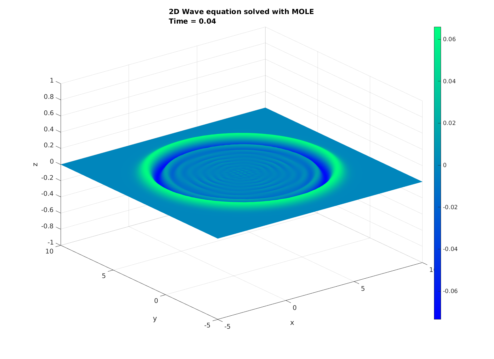

MOLE: Mimetic Operators Library Enhanced
========================================

1: Description
--------------

MOLE is a high quality (C++ & MATLAB) library that implements 
high-order mimetic operators to solve partial differential equations. 
It provides discrete analogs of the most common vector calculus operators: 
Gradient, Divergence, Laplacian, Bilaplacian and Curl. These operators (matrices) act 
on staggered grids (uniform and nonuniform) and they satisfy local and 
global conservation laws.

The mathematics is based on the work of [Corbino and Castillo, 2020]. 
However, the user may find useful previous publications such as [Castillo and Grone, 2003],
in which similar operators are derived using a matrix analysis approach.

2: Licensing
------------

MOLE is distributed under a GNU General Public License, please refer to the _LICENSE_ 
file for more details.

3.1: Installation (Linux)
-------------------------

To use MOLE (C++ version), you need to have _Armadillo C++_ <http://arma.sourceforge.net> and _SuperLU_ 
<https://portal.nersc.gov/project/sparse/superlu> installed on your computer.

Assuming a working installation of _SuperLU_ (`sudo apt install libsuperlu-dev` or `sudo yum install SuperLU-devel`), follow these steps:

`wget http://sourceforge.net/projects/arma/files/armadillo-10.2.1.tar.xz`

`tar xvf armadillo-10.2.1.tar.xz`

`cd armadillo-10.2.1`

**NOTE:** We suggest to use the latest stable version that is available.

Undefine `ARMA_USE_LAPACK` and `ARMA_USE_BLAS` (in case you don't have them installed), then define `ARMA_USE_SUPERLU` and `ARMA_USE_OPENMP` in `include/armadillo_bits/config.hpp`. Make sure that you have `cmake` and `g++` installed before executing:

`./configure`

`make`

this will create `libarmadillo.so`.

Now go to `mole/mole_C++` and modify the path to _Armadillo_ in the `Makefile` 
e.g. `ARMA = /home/johnny/Desktop/armadillo-10.2.1`.

**NOTE:** Do the same with the `Makefile` located in `mole/examples_C++`.

Lastly, build MOLE by executing:

`make`

a static library named `libmole.a` will get created. From this point you just need to include `mole.h` 
in your projects and specify the location of `libmole.a` to the linker.

**For the MATLAB version of our library, the only dependency is to have MATLAB installed**.
The two implementations of MOLE (C++ & MATLAB) are independent, that is, you don't need
to build the C++ version if you are just interested in using MOLE from MATLAB.

3.2: Installation (MacOS)
-------------------------

First, download _Eigen_ from <https://gitlab.com/libeigen/eigen/-/archive/3.4.0/eigen-3.4.0.tar.gz>, and _Armadillo C++_ from <http://arma.sourceforge.net>.

Extract _Eigen_ and _Armadillo_, you can use the following command for each compressed file:

`tar xvf name_of_the_file_including_extension --directory target_directory`

Now, proceed to download MOLE <https://github.com/jcorbino/mole/archive/refs/heads/master.zip> and extract the file:

`unzip master.zip –d mole`

after that, enter MOLE's directory `cd mole` and edit the following files:

`mole_C++/utils.cpp` (line 4) to be simply `#include <Eigen/SparseLU>`

`mole_C++/Makefile` (line 18) should be `CXXFLAGS = -O3 -std=c++11`

same for (line 19) of `examples_C++/Makefile`.

Lastly, (line 25) of `examples_C++/Makefile` should not include `-larmadillo`.

At this point, you just need to edit the `Makefile` located in MOLE's root directory by setting the correct path to each dependency (_Eigen_ and _Armadillo_), that is:

(Line 2) of that `Makefile` should look like: `ARMA = ../../armadillo-10.7.0` and (line 7) should be `EIGEN = ../../eigen-3.4.0`.

Now, just build the library and its examples by simply executing `make` from MOLE's root folder.

**IMPORTANT**: In order to build any of the aforementioned packages, the operating system needs to have `g++` (_GNU Compiler_) and `make` (utility) installed. Those two packages will get installed when you set up _Xcode_ on your Mac: `xcode-select --install`.

4: Documentation
----------------
The folder `doc_MATLAB` contains generated documentation about the MATLAB version.
It was generated with a tool called _m2html_ which can be found here: <https://www.artefact.tk/software/matlab/m2html>.

To generate the C++ documentation, just execute:

`doxygen Doxyfile` (requires _Doxygen_ and _Graphviz_)

this will create a folder called `doc_C++` containing a set of _html_ files. Please refer to the _index.html_ file 
to start browsing the documentation.

5: Citations
------------

Please cite our work if you use MOLE in your research and/or software. 
Citations are useful for the continued development and maintenance of 
the library https://www.sciencedirect.com/science/article/abs/pii/S0377042719303231

