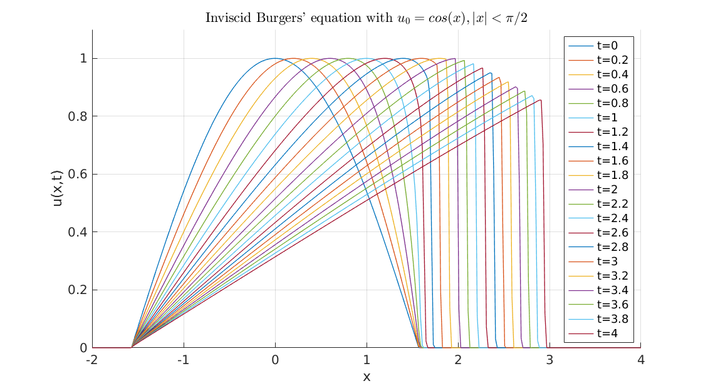

MOLE: Mimetic Operators Library Enhanced
========================================

1: Description
--------------

MOLE is a high-quality (C++ & MATLAB/Octave) library that implements 
high-order mimetic operators to solve partial differential equations. 
It provides discrete analogs of the most common vector calculus operators: 
Gradient, Divergence, Laplacian, Bilaplacian and Curl. These operators (matrices) act 
on staggered grids (uniform and non-uniform) and satisfy local and 
global conservation laws.

Mathematics are based on the work of [Corbino and Castillo, 2020](https://doi.org/10.1016/j.cam.2019.06.042). 
However, the user may find useful previous publications, such as [Castillo and Grone, 2003](https://doi.org/10.1137/S0895479801398025),
in which similar operators were derived using a matrix analysis approach.

2: Licensing
------------

MOLE is distributed under a GNU General Public License, please refer to the _LICENSE_ 
file for more details.

3: Installation (Linux)
-----------------------

To use MOLE (C++ version), you need to have _Armadillo C++_ <http://arma.sourceforge.net>, _SuperLU_ 
<https://portal.nersc.gov/project/sparse/superlu>, and _OpenBLAS_ <https://www.openblas.net> installed on your computer.

Assuming a working installation of _SuperLU_ (`sudo apt install libsuperlu-dev` or `sudo yum install SuperLU-devel`), and _OpenBLAS_ (`sudo apt install libopenblas-dev` or `sudo yum install openblas-devel`), follow these steps:

`wget https://sourceforge.net/projects/arma/files/armadillo-12.6.6.tar.xz`

`tar xvf armadillo-12.6.6.tar.xz`

`cd armadillo-12.6.6`

**NOTE:** We suggest to use the latest stable version.

Define `ARMA_USE_SUPERLU` and `ARMA_USE_OPENMP` in `include/armadillo_bits/config.hpp`. Make sure that you have `cmake` and `g++` installed before executing:

`./configure`

`make`

this will create `libarmadillo.so`.

Now go to `mole/` and build MOLE via:

`ARMA=PATH_TO_ARMADILLO_FOLDER make`

A static library named `libmole.a` will get created after the previous step. From this point you just need to include `mole.h` 
in your projects and specify the location of `libmole.a` to the linker. For the users that are interested in building MOLE as a _shared library_, you just need to specify `make SHARED_LIB=1`. Make sure to include `mole_C++` directory in `LD_LIBRARY_PATH` (`export LD_LIBRARY_PATH=/full/path/to/mole_C++`) so the loader can find the library at runtime.

**For the MATLAB/Octave version of our library, the only dependency is to have MATLAB/Octave installed**.
The two implementations of MOLE (C++ & MATLAB/Octave) are independent, that is, you don't need
to build the C++ version if you are just interested in using MOLE from MATLAB/Octave.

4: Documentation
----------------
The folder `doc_MATLAB` contains generated documentation about the MATLAB/Octave API.
It was generated with a tool called [_m2html_](https://www.gllmflndn.com/software/matlab/m2html). However, for a quick start on MOLE's MATLAB/Octave version, we recommend to start with this short [guide](https://github.com/jcorbino/mole/blob/master/CSRC%20Report%20on%20MOLE.pdf).

To generate the C++ documentation, just execute:

`doxygen Doxyfile` (requires _Doxygen_ and _Graphviz_)

this will create a folder called `doc_C++` containing a set of _html_ files. Please refer to the _index.html_ file 
to start browsing the documentation.

**NOTE:**
Performing non-unary operations involving operands constructed over different grids may lead to unexpected results. While MOLE currently allows such operations without throwing errors, users must exercise caution when manipulating operators across different grids. We advise users to ensure consistency in the grids associated with the operators being operated on.

5: Citations
------------

Please cite our work if you use MOLE in your research and/or software. 
Citations are useful for the continued development and maintenance of 
the library 

